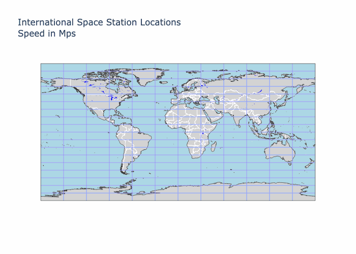

# A lighweight personal prject that retrives location and velocity data from the  International Space Station (ISS) units to meters per second and plots realtime location.


## Here is what this looks like:



## Instructions:

in a new activated python >= 3.9.5 virtula enviroment 

```zsh
pip install -r dependencies.txt
```
